# Classification d'images satellites : branche `bugfix-ticket3`

Cette branche corrige le **ticket 3** (la liste des prédictions affiche « Prédiction None ») et ajoute la **surveillance** de l'application : journalisation MySQL, monitoring Langfuse et alertes par e-mail.

## Sommaire

- [Présentation du projet](#présentation-du-projet)
- [Installation](#installation)
- [Bugfix (ticket 3)](#bugfix-ticket-3)
- [Logging](#logging)
- [Langfuse](#langfuse)

---

## Présentation du projet

L'application classifie des images satellites à l'aide d'un réseau de neurones convolutif (CNN) et conserve l'historique des prédictions.

| Composant | Technologie | Rôle |
| --- | --- | --- |
| Client | Streamlit | Interface utilisateur (envoi d'images, liste des prédictions, logs) |
| API | FastAPI | Accès au modèle et aux données, documentation Swagger (`/docs`) |
| Modèle | CNN (PyTorch) | Classification des images |
| Base de données | MySQL | Prédictions, labels, logs |
| Administration | Adminer | Consultation de la base |
| Monitoring | Langfuse (instance externe) | Traces, latence, alertes |

L'ensemble (client, API, base, Adminer) s'exécute avec Docker Compose. Les services communiquent dans le réseau interne par leur nom de service. Cette séparation en couches permet d'isoler chaque composant lors du diagnostic d'un incident.

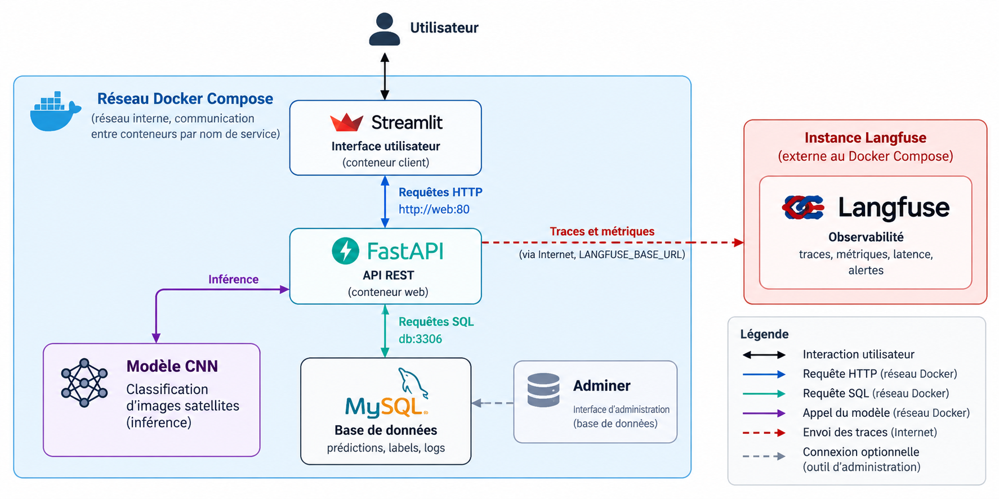

### Branches

| Branche | Contenu |
| --- | --- |
| `ticket3` | Version qui **contient le bug** (point de départ du diagnostic) |
| `bugfix-ticket3` | Correction, tests, journalisation et monitoring |

---

## Installation

### Récupération du projet

Prérequis : Git, Docker avec Docker Compose, et Python 3.11 pour un lancement local 

```bash
git clone https://github.com/TangiLC/e5-2026-cnn.git
cd e5-2026-cnn
git checkout bugfix-ticket3
cp .env.example .env
```

Le dossier `tests` contient des images satellite.

### Démarrage avec Docker

Depuis la racine du projet, vérifier les valeurs du fichier `.env`, puis lancer :

```bash
docker compose up --build -d
```

| Service | Adresse par défaut |
| --- | --- |
| Client Streamlit | http://localhost:8501 |
| Documentation API | http://localhost:8081/docs |
| Adminer | http://localhost:8080 |
| MySQL | localhost:3306 |

Dans Adminer, utiliser le serveur `db` et les valeurs `MYSQL_USER`, `MYSQL_PASSWORD` et `MYSQL_DATABASE` du `.env`.

```bash
docker compose logs -f
docker compose down
```

Les données MySQL sont conservées dans `databases/`, et les images reçues dans `api/satelite_images/`. `data/db/init.sql` est exécuté uniquement lors de la création d'une base sur un dossier de données vide. Modifier les identifiants dans `.env` ne modifie pas les comptes d'une base déjà initialisée.

> **Base existante** : si `databases/` n'est pas vide, les nouvelles tables (voir [Logging](#table-logs)) ne sont pas créées automatiquement. Exécuter la requête de création dans Adminer.

### Configuration

Compose lit automatiquement le `.env` à la racine pour les identifiants et les ports publiés. Il transmet à chaque application uniquement les variables dont elle a besoin. Les connexions entre conteneurs utilisent `db:3306` et `web:80`, indépendamment des ports publiés sur la machine.

Les configurations Python chargent ce même `.env` avec `python-dotenv` pour un lancement local, sans écraser les variables déjà présentes dans l'environnement. Les identifiants MySQL n'ont aucune valeur par défaut dans le code Python. `DB_HOST`, `DB_PORT` et `API_BASE_URL` servent aux connexions locales ; Compose les remplace par les adresses internes appropriées.

Si `API_PORT` change, adapter aussi `API_BASE_URL` pour le client lancé localement. `UPLOAD_FOLDER` est relatif au dossier `api/` en local ; Compose fixe son chemin au dossier persistant monté dans le conteneur.

L'API attend que MySQL soit prêt. Après modification des dépendances, relancer `docker compose up --build -d`.

Les variables propres à la journalisation et au monitoring sont décrites dans [Logging](#logging) et [Langfuse](#langfuse). Le fichier `.env.example` (sans valeurs) les liste toutes ; le `.env` n'est jamais versionné.

### Lancement Python local

Le modèle CNN utlise les dépendances `torch` et `cuda` et leurs dépendances en
cascade. Le premier lancement prend du temps pour le chargement de ces éléments.

Avec Python 3.11 et les dépendances installées dans un environnement virtuel, lancer MySQL et Adminer avec `docker compose up -d db adminer`, puis :

```bash
cd api
python -m pip install -r requirements.txt
python -m uvicorn app.main:app --host 127.0.0.1 --port 8081
```

Adapter le port Uvicorn si `API_PORT` a été modifié.

Dans un deuxième terminal depuis la racine :

```bash
cd client
python -m pip install -r requirements.txt
python -m streamlit run app.py
```

---

## Bugfix (ticket 3)

### Présentation du bug

**Reproduction**

1. Lancer l'application.
2. Sélectionner la puce *Voir les prédictions* dans la barre de navigation.
3. La liste des prédictions enregistrées n'affiche que des « Prédiction None ».

**Résultat obtenu** : toutes les prédictions sont nommées « Prédiction None ».
**Résultat attendu** : les prédictions sont numérotées (« Prédiction 1 », « Prédiction 2 », etc.).

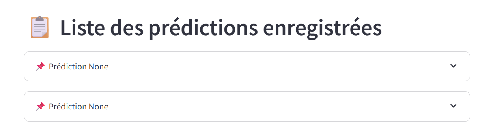

Le bug est **silencieux** : l'API répond `200`, aucune exception n'est levée et les logs Docker ne montrent aucune erreur. Seul le champ `id` vaut `null`.

### Déroulé du débug

Le diagnostic remonte les couches de l'application, de la base de données vers l'interface.

| Étape | Outil | Constat |
| --- | --- | --- |
| 1. La base contient-elle les identifiants ? | Adminer | Oui : `id` est la clé primaire, auto-incrémentée. L'hypothèse d'un identifiant absent en base est écartée. |
| 2. Que renvoie l'API ? | Swagger (`GET /predictions/`) | Les données sont renvoyées, mais `"id": null`. Le défaut se situe entre la lecture en base et la réponse de l'API ; Streamlit est écarté. |
| 3. D'où vient le `null` ? | Débogueur (point d'arrêt) et lecture du code | Les lignes renvoyées par le curseur ne contiennent pas la clé `id` : la requête SQL ne sélectionne pas `predictions.id`. |

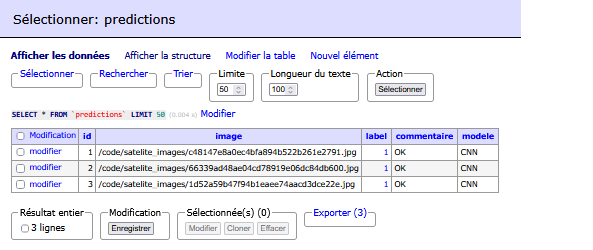
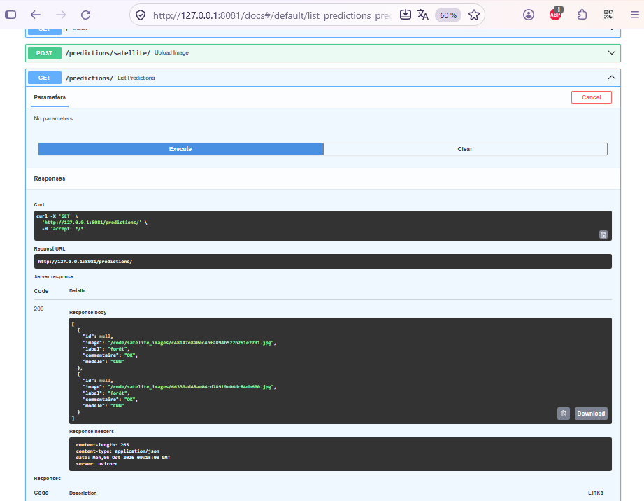
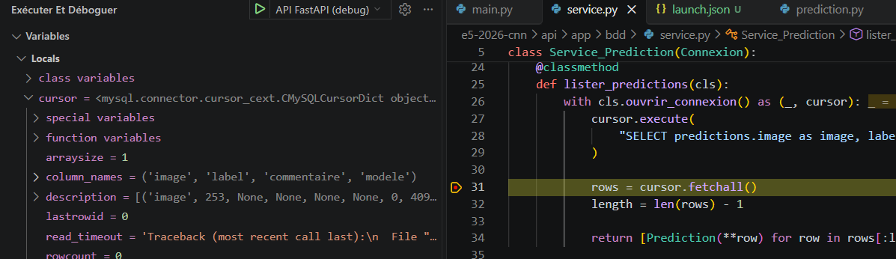

**Procédure de débogage (lancement local)**

1. Démarrer MySQL : `docker compose up -d db adminer`.
2. Installer debugpy si absent de l'environnement : `pip install debugpy`
3. Lancer l'API depuis l'éditeur en mode debug (exemple VS Code, `.vscode/launch.json`) :

```json
{
  "version": "0.2.0",
  "configurations": [
    {
      "name": "API FastAPI (debug)",
      "type": "debugpy",
      "request": "launch",
      "module": "uvicorn",
      "python": "${workspaceFolder}/.venv/bin/python",
      "args": ["app.main:app", "--host", "127.0.0.1", "--port", "8081"],
      "cwd": "${workspaceFolder}/e5-2026-cnn/api",
      "envFile": "${workspaceFolder}/e5-2026-cnn/.env",
      "justMyCode": true
    }
  ]
}

```

3. Poser un point d'arrêt dans la méthode qui liste les prédictions, juste après la lecture du curseur.
4. Appeler `GET /predictions/` depuis Swagger et inspecter les lignes lues : la clé `id` est absente.


**Cause racine**

La requête initiale ne sélectionnait pas l'identifiant, et le schéma Pydantic autorisait `id: int | None = None`. L'absence d'`id` ne provoquait donc aucune erreur de validation.

```python
# Requête initiale (branche ticket3)
cursor.execute(
    """SELECT predictions.image as image, labels.label as label,
              predictions.commentaire as commentaire, predictions.modele as modele
       FROM predictions
       JOIN labels ON predictions.label = labels.id"""
)
```

```python
# Schéma initial
class Prediction(BaseModel):
    id: int | None = None
    image: str
    label: str
    commentaire: str
    modele: str
```

### Correction

**1. Requête SQL** : sélection explicite de `predictions.id`.

```python
cursor.execute(
    """SELECT predictions.id as id, predictions.image as image, labels.label as label,
              predictions.commentaire as commentaire, predictions.modele as modele
       FROM predictions
       JOIN labels ON predictions.label = labels.id"""
)
```

**2. Séparation des schémas (DTO)** : une prédiction **avant insertion** n'a pas d'`id` (généré par l'auto-incrément), une prédiction **relue en base** en a toujours un. Deux schémas distinguent ces deux états, au lieu d'un type unique `int | None` qui masquait l'erreur.

```python
class PredictionCreate(BaseModel):
    """Prédiction avant insertion : pas d'id."""
    model_config = ConfigDict(extra="forbid")
    image: str
    label: str
    commentaire: str
    modele: str

class PredictionRead(PredictionCreate):
    """Prédiction relue en base : id obligatoire."""
    id: int
```

Une réponse sans `id` lève désormais une erreur de validation visible, au lieu d'un `id: null` renvoyé avec un code `200`. `extra="forbid"` refuse en outre les champs inattendus.

Le Schéma Prediction a été remplacé par les DTO correspondants dans les différents services.

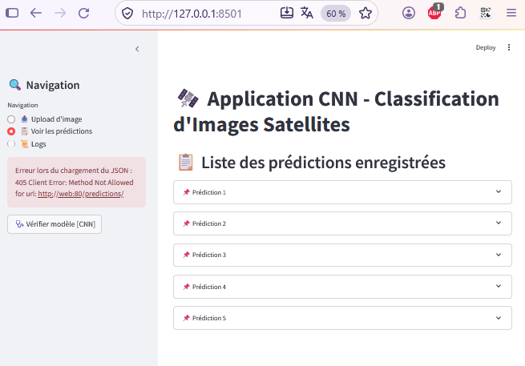

#### Tests

| Fichier | Ce qui est vérifié |
| --- | --- |
| `test_prediction_schema.py` | `PredictionCreate` refuse `id` et toute clé inconnue ; `PredictionRead` exige un `id` entier (absent, `None` ou mal typé : rejeté) ; la route `GET /predictions/` lève une `ResponseValidationError` pour une réponse invalide. |
| `test_requete_bdd.py` | Sur une base SQLite en mémoire, la requête initiale ne renvoie pas `id`, la requête corrigée le renvoie (valeurs 1 et 2) avec le bon label. |

Installation et lancement :

```bash
python -m pip install pytest pytest-cov
python -m pytest -v
python -m pytest --cov=app --cov-report=term-missing
```

**Couverture.** Les tests portent volontairement sur le périmètre du ticket 3 (schémas, route de lecture, requête). Le module des schémas (`prediction.py`) est couvert à 100 % ; la couverture globale mesurée est de 47 % (273 instructions, 145 non couvertes), car les autres modules (connexion, journalisation, observabilité, démarrage de l'API) ne sont pas testés dans ce périmètre.

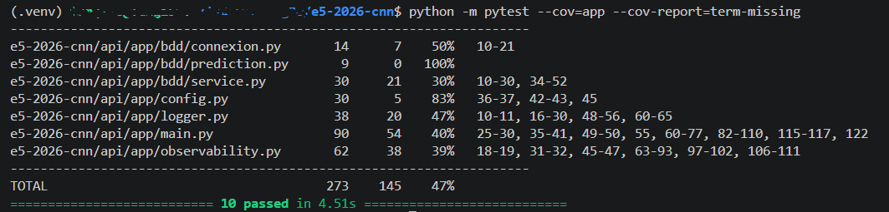

#### Versionnement

- `ticket3` conserve le bug ; `bugfix-ticket3` porte la correction et les tests, afin de garder l'historique de la résolution.
- Intégration dans la branche principale par pull request (merge) depuis `bugfix-ticket3`.
- Une git diff peut être faite entre la branche `ticket3` et `bugfix-ticket3` pour pointer les corrections apportées.


---

## Logging

Une journalisation persistante dans MySQL conserve les événements utiles au diagnostic. Elle est pour l'instant mise en place sur les événements liés au ticket 3 ; elle devrait être étendue à l'ensemble de l'application pour une traçabilité fine.

### Table logs

```sql
CREATE TABLE IF NOT EXISTS `logs` (
  `id` bigint NOT NULL AUTO_INCREMENT,
  `timestamp` datetime(3) NOT NULL,
  `level` varchar(10) NOT NULL,
  `module` varchar(100) NOT NULL,
  `message` text NOT NULL,
  PRIMARY KEY (`id`),
  KEY `timestamp` (`timestamp`)
) ENGINE=InnoDB DEFAULT CHARSET=utf8mb4 COLLATE=utf8mb4_0900_ai_ci;
```

- **Nouvelle base** : la table est créée automatiquement par `data/db/init.sql`.
- **Base existante** (dossier `databases/` non vide) : `init.sql` n'est pas rejoué. Ouvrir Adminer (http://localhost:8080), choisir *Requête SQL*, coller la requête ci-dessus et l'exécuter.

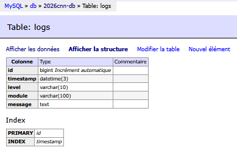

> **Point d'attention** : `timestamp` est un `DATETIME` sans fuseau horaire. Les horodatages sont ceux du serveur de l'API (souvent UTC dans un conteneur)

### Purge périodique

| Clé du `.env` | Défaut | Rôle |
| --- | --- | --- |
| `LOG_RETENTION_DAYS` | `0` | Durée de conservation des logs en jours. `0` (ou une valeur négative) désactive la purge. |

La purge est planifiée **dans l'API**, sans cron ni tâche Docker : au démarrage de FastAPI, une tâche asynchrone exécute `purge_old()`, puis recommence toutes les 24 heures (`main.py`). Elle est annulée à l'arrêt de l'application.

```env
LOG_RETENTION_DAYS=30
```

### Visualisation dans Streamlit

Le menu latéral du client contient une entrée **« 📜 Logs »**. Elle interroge la route de consultation des logs de l'API et affiche les enregistrements dans un tableau.

Limites actuelles : la route ne propose ni filtre ni pagination et renvoie l'ensemble de la table. La purge périodique limite sa taille ; un filtre par niveau et une limite de lignes sont à envisager en v2, de même que réserver cette route aux rôles admin. Les événements du webhook d'alerte ne sont pas encore journalisés.

---

## Langfuse

[Langfuse](https://langfuse.com) trace les opérations de l'application, mesure leur latence et déclenche des alertes.

### Accès à l'instance

L'instance Langfuse est **auto-hébergée, sécurisée et externe à ce dépôt** : elle est mutualisée avec d'autres projets et n'est pas déployée par `docker-compose.yml`. Cela évite une infrastructure supplémentaire et laisse le contrôle des données sans abonnement ni dépendance à un SaaS tiers.

L'application **ne dépend pas de Langfuse** : si l'instance est inaccessible, les traces sont ignorées et l'application continue de fonctionner.

Un script `observability.py` fait le lien entre l'app et Langfuse, en créant les span d'observabilité dans les services. 

**Mise en place**

1. Dans l'instance Langfuse, créer un projet.
2. Récupérer la clé publique et la clé secrète du projet (*Settings > API Keys*).
3. Renseigner le `.env` (jamais versionné ; `.env.example` fournit le modèle).

| Variable | Exemple / défaut | Rôle |
| --- | --- | --- |
| `LANGFUSE_PUBLIC_KEY` | `pk-lf-...` | Clé publique du projet |
| `LANGFUSE_SECRET_KEY` | `sk-lf-...` | Clé secrète du projet (à ne jamais commiter) |
| `LANGFUSE_BASE_URL` | `https://langfuse.example.com` | URL de l'instance |
| `LANGFUSE_ENV` | `dev` | Environnement indiqué dans les traces |
| `LANGFUSE_SERVICE_NAME` | `name` | Nom du service indiqué dans les traces |
| `LANGFUSE_RELEASE` | `local` | Version indiquée dans les traces |
| `LANGFUSE_SAMPLE_RATE` | `1.0` | Proportion de traces envoyées (`1.0` = 100 %) |
| `LANGFUSE_TIMEOUT_SECONDS` | `5` | Délai maximal des requêtes vers Langfuse |
| `LANGFUSE_FLUSH_AT` | `20` | Nombre d'événements regroupés avant envoi |
| `LANGFUSE_FLUSH_INTERVAL_MS` | `2000` | Délai maximal entre deux envois (ms) |
| `LANGFUSE_DEBUG` | `false` | Active les logs de debug du SDK |

### Traces et KPI

| Trace | Surveillance | KPI | Alerte |
| --- | --- | --- | --- |
| `satellite_prediction` | **Modèle** : inférence du CNN | Latence (ms) | Warning 60 ms, alerte 80 ms (dev) |
| `model_health` | **Modèle** : disponibilité du CNN | Disponible / erreur | Non alerté |
| `db.read.predictions` | BDD : lecture des prédictions | Latence (ms) | Non alerté |
| `db.write.prediction` | BDD : écriture d'une prédiction | Latence (ms) | Non alerté |

Deux KPI suivent le modèle : sa **disponibilité** (route `model_health`) et sa **latence d'inférence**. Ils détectent les défaillances opérationnelles les plus immédiates. Ils ne mesurent pas la qualité des prédictions, faute de vérité terrain en production. À plus long terme, des indicateurs plus fins (distribution des classes prédites, niveaux de confiance, dérive) pourraient être ajoutés.


**Mise à jour des indicateurs** : chaque opération produit une trace envoyée à Langfuse par lots (`LANGFUSE_FLUSH_AT`, `LANGFUSE_FLUSH_INTERVAL_MS`). La règle d'alerte est évaluée à intervalle régulier, défini dans le dashboard Langfuse
(5 minutes) 

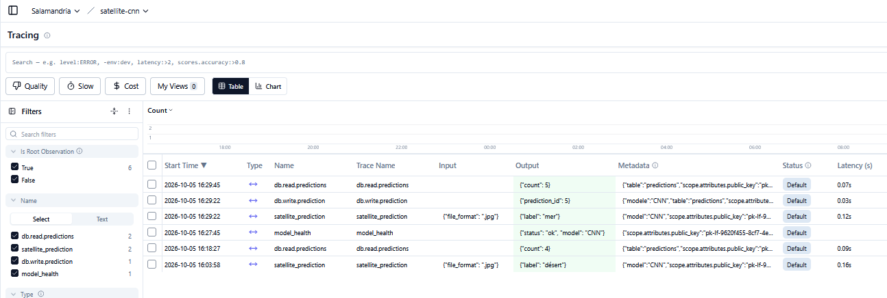

### Alertes : webhook et e-mail

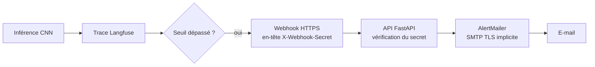

1. Langfuse évalue la latence des observations de la trace `satellite_prediction`.
2. Quand un seuil est franchi, il appelle un **webhook HTTPS** exposé par l'API cible.
3. L'API vérifie le secret partagé de l'en-tête `X-Webhook-Secret`. La requête est **rejetée** si l'en-tête est absent, différent, ou si `WEBHOOK_SECRET` n'est pas configuré.
4. L'API transforme l'alerte en notification et l'envoie par SMTP.

| Variable | Rôle |
| --- | --- |
| `WEBHOOK_SECRET` | Secret partagé entre Langfuse et l'API (en-tête `X-Webhook-Secret`) |
| `SMTP_SERVEUR` | Serveur SMTP |
| `SMTP_PORT` | Port SMTP : **465** (TLS implicite) |
| `SMTP_LOGIN`, `SMTP_PASSWORD` | Identifiants du relais |
| `SMTP_FROM`, `SMTP_TO` | Expéditeur et destinataire de l'alerte |

> **Port SMTP** : l'envoi utilise `smtplib.SMTP_SSL` (TLS implicite). Le port attendu est donc le **465**. Le port 587 (STARTTLS) ne fonctionne pas avec cette configuration.


**Seuils**

- **Développement** : agrégation *Max*, avec des seuils volontairement bas (warning 0,060 s, alerte 0,080 s pour une inférence nominale d'environ 0,050 s), afin qu'une seule inférence lente déclenche l'alerte et permette de tester toute la chaîne.
- **Production** : une mesure sur le 95e percentile (p95) serait plus représentative qu'un maximum ponctuel ; des seuils de départ de 200 ms (warning) et 300 ms (alerte) seraient à recalibrer avec un historique réel pour n'alerter qu'en cas de latence anormale.

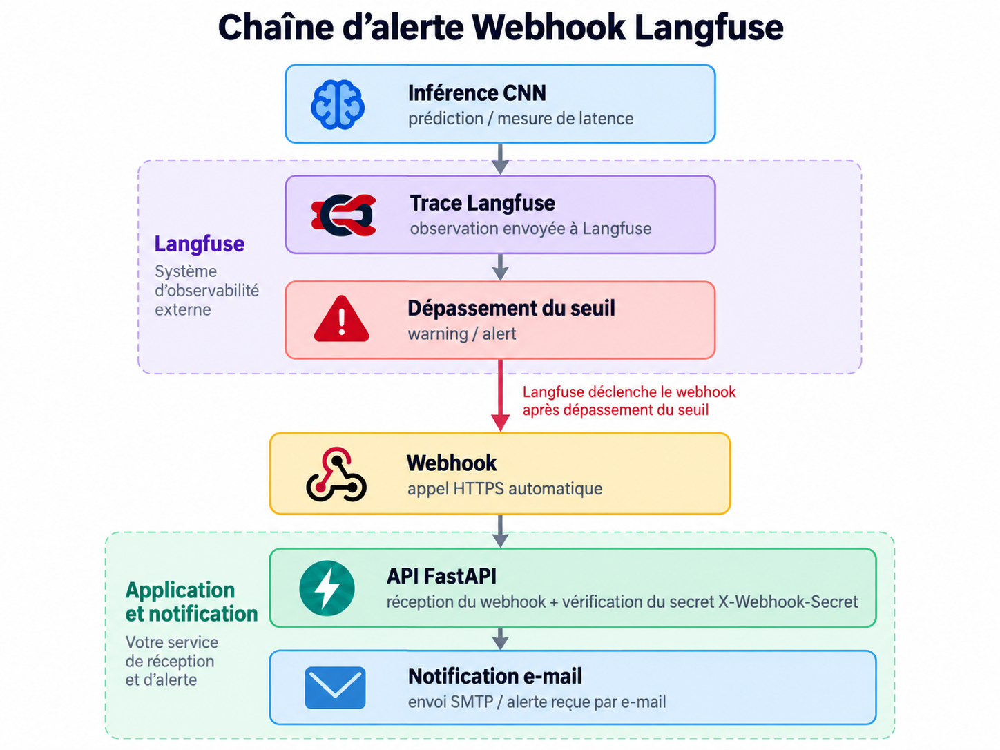

>__Remarque__ : les événements du webhook (secret refusé, échec d'envoi du mail) ne sont pas encore écrits dans la table `logs` ; amélioration à prévoir en v2.

## Boucle de rétroaction

Une colonne de la table predictions (`commentaire`) stocke des données liées à la prédiction.

Ces données peuvent être utilisées pour l'analyse à posteriori de la qualité de l'inférence.

Les images avec un commentaire spécifique peuvent être réutilisées dans les cycles d'entraînement suivants.

>Actuellement, cette feature n'est pas implémentée, les commentaires sont toujours insérés `OK` par défaut, il n'y a pas d'endpoint pour modifier ce champ (ex: label attendu en cas d'erreur ?).
